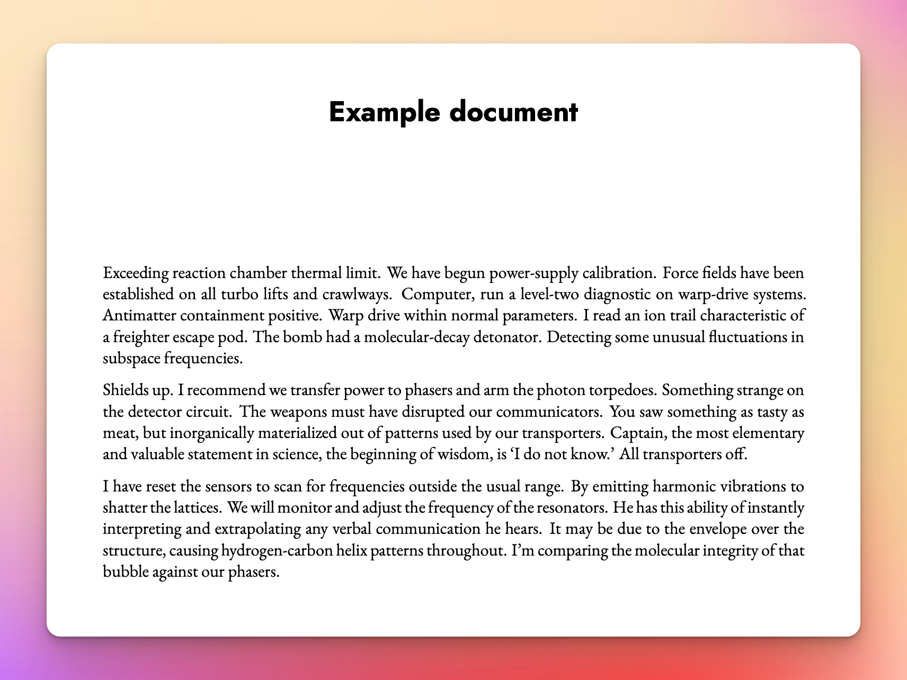
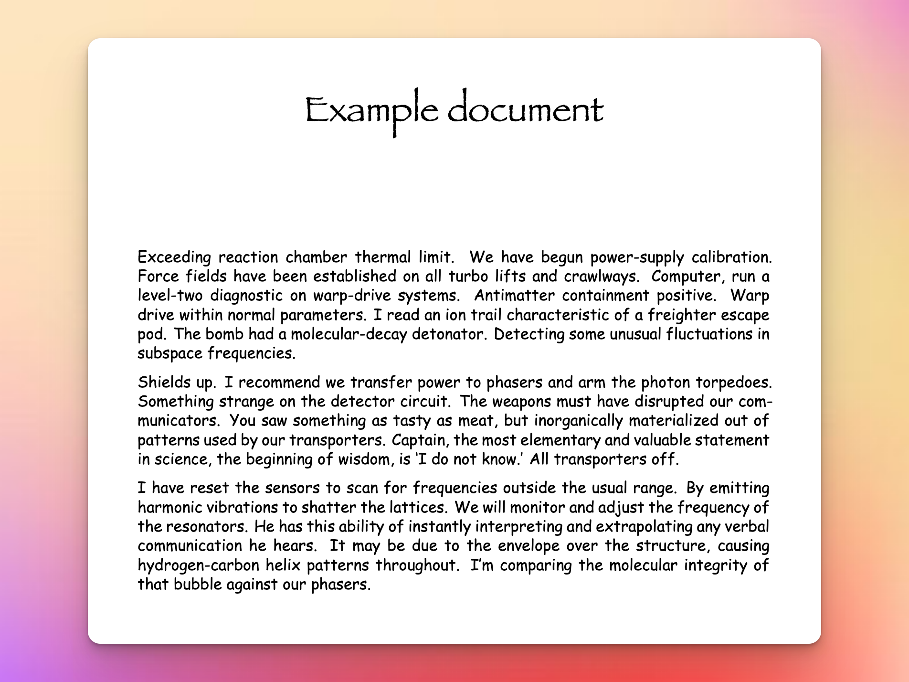

<!-- README.md is generated from README.qmd. Please edit that file -->

# Quarto profiles example

It’s possible to create multiple versions of the same document with the
same output format (i.e. multiple types of PDFs) using Quarto’s [Project
Profiles](https://quarto.org/docs/projects/profiles.html). This
repository shows a quick example of how to do it.

------------------------------------------------------------------------

<div>

> **Update! Switching profiles with {targets}**
>
> It’s now possible to switch profiles with {targets} and {tarchetypes}.
> [See below ↓ for details!](#switching-profiles-with-targets)

</div>

------------------------------------------------------------------------

There are three `_quarto.yml` files here:

1.  `_quarto.yml` defines the overall project settings and sets the
    default profile to `nice`:

    ``` yaml
    project:
      title: "Profiles example"

    profile: 
      default: nice
    ```

2.  `_quarto-nice.yml` defines the document settings when using the
    `nice` profile (with [EB
    Garamond](https://fonts.google.com/specimen/EB+Garamond) and
    [Jost](https://fonts.google.com/specimen/Jost) from Google Fonts).
    It places the rendered PDF in a folder named “output”:

    ``` yaml
    project:
      output-dir: "output"

    format:
      pdf:
        mainfont: "EB Garamond"
        sansfont: "Jost"
    ```

3.  `_quarto-ugly.yml` defines the document settings when using the
    `ugly` profile. It places the rendered PDF in a folder named
    “output-ugly”:

    ``` yaml
    project:
      output-dir: "output-ugly"

    format:
      pdf:
        mainfont: "Comic Sans MS"
        sansfont: "Papyrus"
    ```

With these three files, rendering the document will automatically use
the `nice` profile and generate a PDF like this at
[`output/example.pdf`](output/example.pdf):



To generate the ugly PDF, you can either set an environment variable:

``` sh
export QUARTO_PROFILE=ugly
asdf
quarto render example.qmd
```

Or use a command line option:

``` sh
quarto render example.qmd --profile ugly
```

This will tell Quarto to use the `ugly` profile and it will generate a
PDF like this at [`output-ugly/example.pdf`](output-ugly/example.pdf):



## Switching profiles with {targets}

Switching between the two profiles is easy enough with command line
switches, but it can annoying to run multiple commands (especially since
you can ordinarily make multiple formats like HTML, Word, and PDF
simultaneously—that doesn’t work with multiple versions of the same
output format).

Fortunately the [{targets}](https://docs.ropensci.org/targets/) package
(and its cousin [{tarchetypes}](https://docs.ropensci.org/tarchetypes/))
can generate both versions of the PDF at the same time. Starting with
[the March 11, 2023 version of
{tarchetypes}](https://github.com/ropensci/tarchetypes/commit/29b8e7714be8acacdcaa660483a778183078c21a)
it’s possible to pass the name of a specific profile to `tar_quarto()`,
like so:

``` r
list(
  tar_quarto(document_nice, path = ".", profile = "nice"),
  tar_quarto(document_ugly, path = ".", profile = "ugly")
)
```

That means that we can generate both PDFs simultaneously with this R
command:

``` r
library(targets)
tar_make()

# Or to just make the documents:
tar_make(starts_with("document_"))
```
